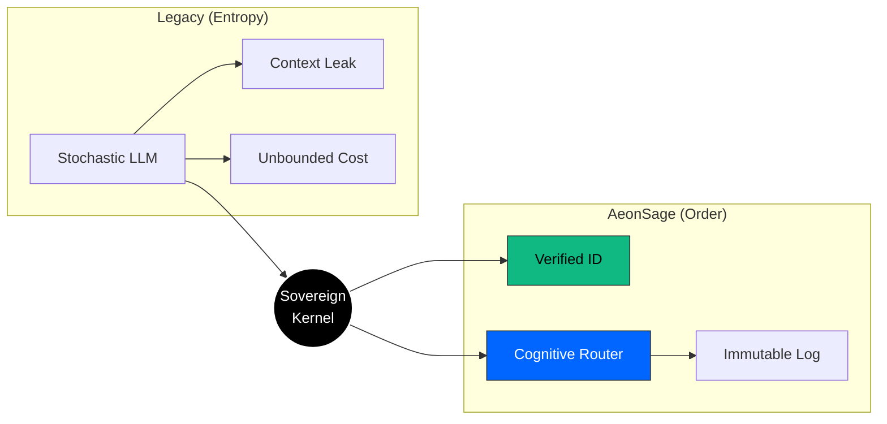

<div align="center">
  <a href="https://aeonsage.org">
    
  </a>

  <br><br>

  **The Sovereign Intelligence Operating System**<br>
  Identity-first. Self-hosted. Deterministic.

  <br>

  [](https://github.com/velonone/Aeonsage/releases)
  [](https://github.com/velonone/Aeonsage)
  [](./LICENSE)
  [](https://aeonsage.org/docs)
  [](./README_ZH.md)

</div>

---

> **Your AI. Your hardware. Your rules.**
>
> AeonSage is a self-hosted AI agent operating system that puts identity and privacy at the kernel level. Unlike cloud-dependent chatbots, AeonSage runs entirely on your hardware — your data never leaves your machine.

---

## Contents

- [Architecture](#architecture)
- [Connectivity](#connectivity-matrix)
- [Desktop Client](#desktop-client)
- [Quick Start](#quick-start)
- [Editions](#editions)
- [Tech Stack](#tech-stack)
- [Ecosystem](#ecosystem-partners)
- [License](#license--legal)

---

## Architecture

AeonSage implements a strict **Kernel-Ring Architecture** with 58+ modules across 6 layers.

```
                         AeonSage Gateway
  ┌──────────┬──────────┬──────────┬──────────┬─────────────┐
  │  Ring 0  │  Ring 1  │  Ring 2  │  Ring 3  │   Ring 4    │
  │  Kernel  │  Router  │  Skills  │ Channels │  Interface  │
  ├──────────┼──────────┼──────────┼──────────┼─────────────┤
  │ Identity │ Multi-LLM│ 54+ Tools│ 30+ Plat │ Cockpit UI  │
  │ State    │ Tiered   │ MCP SDK  │ Protocol │ Desktop App │
  │ Security │ Fallback │ Plugin   │ Bridges  │ WebSocket   │
  └──────────┴──────────┴──────────┴──────────┴─────────────┘
                         107 RPC Methods
```

### Sovereign Transformation

Every user intent is treated as a verifiable transaction — signed, routed, executed, and logged.



### Core Capabilities

| Layer | Component | Description |
| :--- | :--- | :--- |
| **Ring 0** | Sovereign Kernel | Deterministic state machine, VDID identity, active defense wall, audit logger |
| **Ring 1** | Cognitive Router | Multi-LLM routing (local/cloud), tiered complexity analysis, provider fallback cascade |
| **Ring 2** | Skill Extensions | 54+ built-in skills, MCP protocol support, Plugin SDK for custom extensions |
| **Ring 3** | Channel Bridges | 30+ native protocol bridges — WhatsApp, Telegram, Discord, Slack, Signal, Email & more |
| **Ring 4** | Interface Layer | Lit 3 Cockpit UI, Tauri v2 Desktop Client, 107 WebSocket RPC methods |

---

## Connectivity Matrix

Native protocol bridges — no third-party automation required.

| Protocol | Implementation | Capabilities | Status |
| :--- | :--- | :--- | :---: |
| **WhatsApp** | Baileys (wacli) | Multi-device, Media, Voice Notes |  |
| **Telegram** | MTProto / Bot API | Secret Chats, Channels, Admin Ops |  |
| **Discord** | WebSocket Gateway | Voice, Slash Commands, Roles |  |
| **Slack** | Enterprise Grid | Threads, File Analysis, App Home |  |
| **Signal** | libsignal | E2EE Messaging |  |
| **Email** | SMTP / IMAP | Parsing, Drafting, Attachments |  |
| **LINE** | Messaging API | Rich Menus, Flex Messages |  |
| **Matrix** | matrix-js-sdk | Federation, E2EE Rooms |  |

> **30+ channels** supported in total. See the full list in the [documentation](https://aeonsage.org/docs).

---

## Desktop Client

The AeonSage Desktop App is built with **Tauri v2** (Rust) + **React 19** — delivering a native experience at ~10 MB (vs ~150 MB for Electron).

- **Agent Visualization** — Real-time execution flow, tool calls, and reasoning traces
- **Visual Workflows** — Drag-and-drop multi-agent workflow builder
- **BYOK** — Bring Your Own Key, use any model provider with your own API keys
- **Secure Gateway** — Tauri Sidecar manages the Node.js gateway process
- **Cross-Platform** — Windows, macOS, Linux

---

## Quick Start

### System Requirements
- **OS**: Windows 11 / macOS 13+ / Linux Kernel 5.15+
- **Runtime**: Node.js v22.0.0+ (Active LTS)

### Portable (Windows)
1. Download **[AeonSage_OSS.zip](https://github.com/velonone/Aeonsage/releases/latest/download/AeonSage_OSS.zip)**
2. Extract and run `AeonSage.bat`

### Developer Install
```bash
# Clone the repository
git clone https://github.com/velonone/Aeonsage.git
cd Aeonsage

# Install dependencies
pnpm install

# Initialize configuration
pnpm run init

# Launch the gateway
pnpm start
```

The Cockpit UI will be available at `http://localhost:18789`.

---

## Editions

| | Free (OSS) | Pro | Enterprise |
| :--- | :---: | :---: | :---: |
| **Price** | $0 | $59/mo | Custom |
| **Deployment** | Self-hosted | Self-hosted + Cloud | Private Cloud |
| **Cognitive Engine** |  |  |  |
| **Multi-LLM Router** |  |  |  |
| **All Channels** |  |  |  |
| **Visual Workflows** |  |  |  |
| **BYOK** |  |  |  |
| **Cockpit UI** |  |  |  |
| **Desktop Client** |  |  |  |
| **Max Workers** |  |  |  |
| **CloudRelay** |  |  |  |
| **Finance Dashboard** |  |  |  |
| **VDID Identity** |  |  |  |
| **Custom Themes** |  |  |  |
| **Security Dashboard** |  |  |  |
| **Team Management** |  |  |  |
| **Audit & Compliance** |  |  |  |

> **Free edition is fully functional for local AI.** Pro unlocks cloud features and multi-agent workers.

---

## Tech Stack

| Component | Technology |
| :--- | :--- |
| Runtime | Node.js 22+ (ESM) |
| Language | TypeScript 5.x |
| Backend | Hono + Express + WebSocket |
| Cockpit UI | Lit 3.3 + Vite 7 |
| Desktop | Tauri v2 (Rust) + React 19 |
| Auth | Social Login (Telegram / Google / GitHub) + VDID |
| Database | PostgreSQL + SQLite (local) |
| AI | Local (Ollama) + Cloud (OpenRouter, Anthropic, OpenAI, Google) |

---

## Ecosystem Partners

<table>
  <tr>
    <td align="center" width="50%">
      <a href="https://vdid.org"></a><br>
      <br><b>Identity Layer</b><br>VDID Network
    </td>
    <td align="center" width="50%">
      <a href="https://velonlabs.com"></a><br>
      <br><b>Research & Engineering</b><br>VelonLabs
    </td>
  </tr>
</table>

---

## License & Legal

**AeonSage Community Edition** is distributed under the **MIT License** with a trademark addendum.

> **Trademark Notice**: The "AeonSage" name, logo, and the "VDID" verification network are proprietary assets of VelonLabs. Commercial derivatives utilizing the AeonSage brand require an explicit enterprise license. The source code is open — the brand is not.

---

<div align="center">

  

  <br><br>

  **Engineered by [VelonLabs](https://velonlabs.com) & The AeonSage Core Team**

  <br>

  [](https://aeonsage.org)
  [](https://t.me/aeonsage)
  [](https://x.com/AeonSage)

  <br>

  <sub>Copyright &copy; 2025-2026 VelonLabs. All rights reserved.</sub>

</div>
