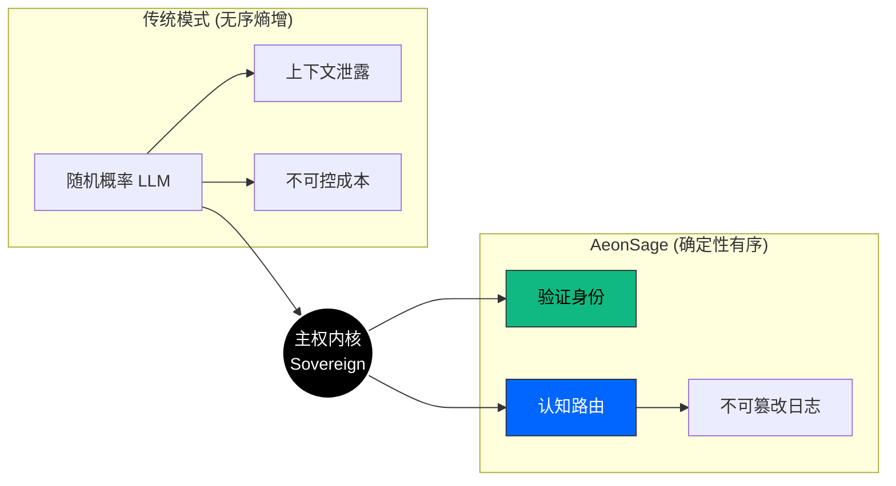

<div align="center">
  <a href="https://aeonsage.org">
    
  </a>

  <br><br>

  **主权级智能操作系统**<br>
  身份优先 · 本地部署 · 确定性运行

  <br>

  [](https://github.com/velonone/Aeonsage/releases)
  [](https://github.com/velonone/Aeonsage)
  [](./LICENSE)
  [](https://aeonsage.org/docs)
  [](./README.md)

</div>

---

> **你的 AI，你的硬件，你的规则。**
>
> AeonSage 是一个本地部署的 AI 智能体操作系统，将身份与隐私置于内核层。与依赖云端的聊天机器人不同，AeonSage 完全运行在你的硬件上 —— 你的数据永远不会离开你的设备。

---

## 目录

- [系统架构](#系统架构)
- [连接矩阵](#连接矩阵)
- [桌面客户端](#桌面客户端)
- [快速开始](#快速开始)
- [版本对比](#版本对比)
- [技术栈](#技术栈)
- [生态合作伙伴](#生态合作伙伴)
- [许可与法律声明](#许可与法律声明)

---

## 系统架构

AeonSage 采用严格的**内核环 (Kernel-Ring) 架构**，包含 58+ 模块，横跨 6 个层级。

```
                         AeonSage Gateway
  ┌──────────┬──────────┬──────────┬──────────┬─────────────┐
  │  Ring 0  │  Ring 1  │  Ring 2  │  Ring 3  │   Ring 4    │
  │  内核层  │  路由层  │  技能层  │  通道层  │   界面层    │
  ├──────────┼──────────┼──────────┼──────────┼─────────────┤
  │ 主权身份 │ 多模型   │ 54+ 工具 │ 30+ 平台 │ Cockpit UI  │
  │ 状态机   │ 分级路由 │ MCP SDK  │ 协议桥接 │ 桌面客户端  │
  │ 安全防御 │ 故障回退 │ 插件系统 │ 原生协议 │ WebSocket   │
  └──────────┴──────────┴──────────┴──────────┴─────────────┘
                         107 个 RPC 方法
```

### 主权转换

每一个用户意图都被视为一笔可验证的交易 —— 签名、路由、执行、记录。



### 核心能力

| 层级 | 组件 | 描述 |
| :--- | :--- | :--- |
| **Ring 0** | 主权内核 | 确定性状态机、VDID 身份验证、主动防御墙、审计记录器 |
| **Ring 1** | 认知路由 | 多 LLM 路由（本地/云端）、分级复杂度分析、提供商级联回退 |
| **Ring 2** | 技能扩展 | 54+ 内置技能、MCP 协议支持、自定义插件 SDK |
| **Ring 3** | 通道桥接 | 30+ 原生协议桥接 — WhatsApp、Telegram、Discord、Slack、Signal、Email 等 |
| **Ring 4** | 界面层 | Lit 3 控制台 UI、Tauri v2 桌面客户端、107 个 WebSocket RPC 方法 |

---

## 连接矩阵

原生协议级桥接，无需第三方自动化服务。

| 协议 | 实现方式 | 核心能力 | 状态 |
| :--- | :--- | :--- | :---: |
| **WhatsApp** | Baileys (wacli) | 多设备登录、媒体收发、语音笔记 |  |
| **Telegram** | MTProto / Bot API | 私密聊天、频道管理、群组管理 |  |
| **Discord** | WebSocket Gateway | 语音频道、Slash 指令、角色映射 |  |
| **Slack** | Enterprise Grid | 线程支持、文件分析、App Home |  |
| **Signal** | libsignal | 端到端加密 (E2EE) 通信 |  |
| **Email** | SMTP / IMAP | 邮件解析、草稿撰写、附件处理 |  |
| **LINE** | Messaging API | Rich Menus、Flex Messages |  |
| **Matrix** | matrix-js-sdk | 联邦协议、E2EE 房间 |  |

> 总计支持 **30+ 通道**。完整列表请参阅[文档](https://aeonsage.org/docs)。

---

## 桌面客户端

AeonSage 桌面应用基于 **Tauri v2** (Rust) + **React 19** 构建 —— 原生体验，仅 ~10 MB（Electron 需 ~150 MB）。

- **Agent 可视化** — 实时执行流程、工具调用与推理链路展示
- **可视化工作流** — 拖拽式多 Agent 工作流构建器
- **BYOK** — 自带密钥，使用你自己的 API 密钥接入任意模型
- **安全网关** — Tauri Sidecar 管理 Node.js 网关进程
- **跨平台** — Windows、macOS、Linux

---

## 快速开始

### 系统要求
- **OS**: Windows 11 / macOS 13+ / Linux Kernel 5.15+
- **运行时**: Node.js v22.0.0+ (Active LTS)

### 便携版 (Windows)
1. 下载 **[AeonSage_OSS.zip](https://github.com/velonone/Aeonsage/releases/latest/download/AeonSage_OSS.zip)**
2. 解压后运行 `AeonSage.bat`

### 开发者安装
```bash
# 克隆仓库
git clone https://github.com/velonone/Aeonsage.git
cd Aeonsage

# 安装依赖
pnpm install

# 初始化配置
pnpm run init

# 启动网关
pnpm start
```

控制台 UI 将在 `http://localhost:18789` 可用。

---

## 版本对比

| | 免费版 (OSS) | 专业版 | 企业版 |
| :--- | :---: | :---: | :---: |
| **价格** | $0 | $59/月 | 定制 |
| **部署** | 本地自托管 | 本地 + 云端 | 私有云 |
| **认知引擎** |  |  |  |
| **多模型路由** |  |  |  |
| **全部通道** |  |  |  |
| **可视化工作流** |  |  |  |
| **BYOK（自带密钥）** |  |  |  |
| **控制台 UI** |  |  |  |
| **桌面客户端** |  |  |  |
| **最大 Worker 数** |  |  |  |
| **CloudRelay** |  |  |  |
| **金融仪表盘** |  |  |  |
| **VDID 身份** |  |  |  |
| **自定义主题** |  |  |  |
| **安全仪表盘** |  |  |  |
| **团队管理** |  |  |  |
| **审计与合规** |  |  |  |

> **免费版对本地 AI 完全可用。** 专业版解锁云端功能与多 Agent Worker。

---

## 技术栈

| 组件 | 技术 |
| :--- | :--- |
| 运行时 | Node.js 22+ (ESM) |
| 语言 | TypeScript 5.x |
| 后端 | Hono + Express + WebSocket |
| 控制台 UI | Lit 3.3 + Vite 7 |
| 桌面客户端 | Tauri v2 (Rust) + React 19 |
| 认证 | 社交登录 (Telegram / Google / GitHub) + VDID |
| 数据库 | PostgreSQL + SQLite (本地) |
| AI | 本地 (Ollama) + 云端 (OpenRouter, Anthropic, OpenAI, Google) |

---

## 生态合作伙伴

<table>
  <tr>
    <td align="center" width="50%">
      <a href="https://vdid.org"></a><br>
      <br><b>身份层</b><br>VDID Network
    </td>
    <td align="center" width="50%">
      <a href="https://velonlabs.com"></a><br>
      <br><b>研究与工程</b><br>VelonLabs
    </td>
  </tr>
</table>

---

## 许可与法律声明

**AeonSage 社区版** 采用 **MIT 许可证** 分发，附带商标条款。

> **商标声明**: "AeonSage" 名称、Logo 以及 "VDID" 验证网络是 VelonLabs 的专有资产。任何利用 AeonSage 品牌进行的商业衍生行为均需获得明确的企业授权。代码是开源的 —— 品牌不是。

---

<div align="center">

  

  <br><br>

  **由 [VelonLabs](https://velonlabs.com) 与 AeonSage 核心团队精心打造**

  <br>

  [](https://aeonsage.org)
  [](https://t.me/aeonsage)
  [](https://x.com/AeonSage)

  <br>

  <sub>Copyright &copy; 2025-2026 VelonLabs. All rights reserved.</sub>

</div>
