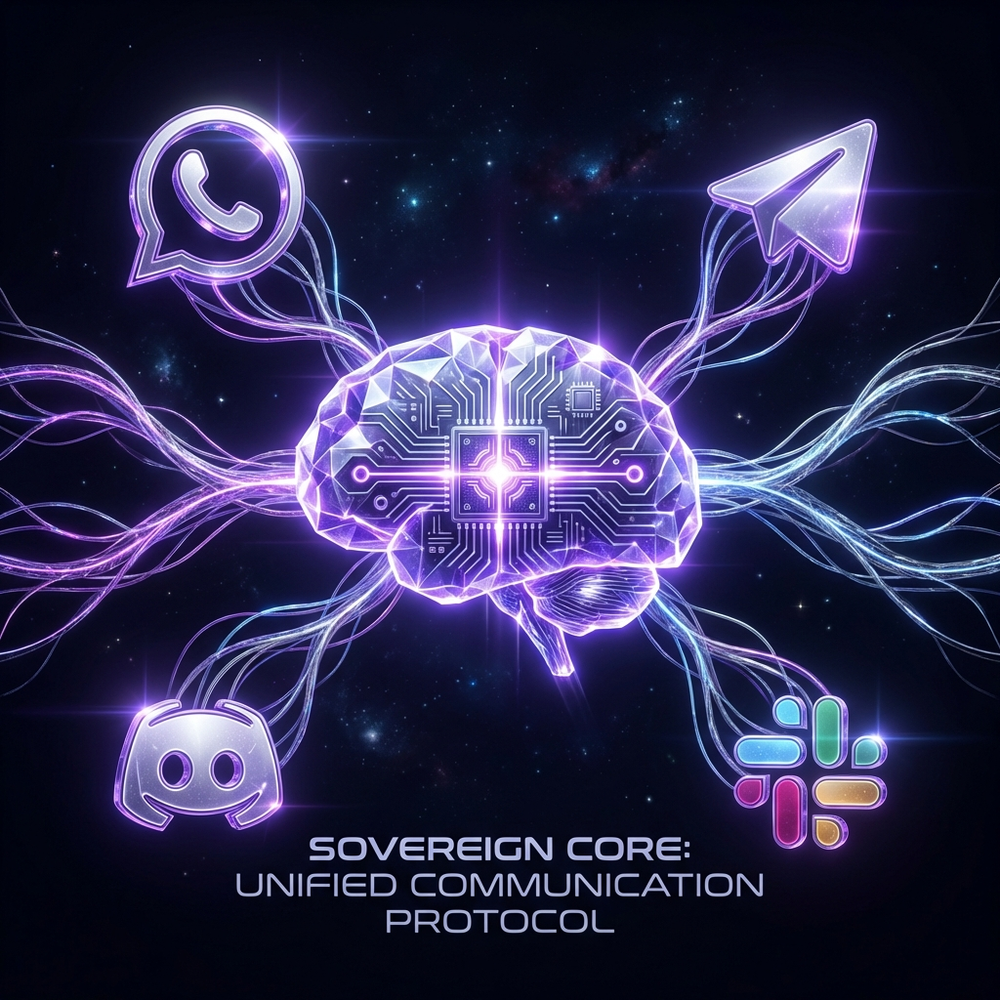

# Chat Channels

AeonSage can talk to you on any chat app you already use. Each channel connects via the Gateway.
Text is supported everywhere; media and reactions vary by channel.

## Supported channels

- [WhatsApp](/channels/whatsapp) �Most popular; uses Baileys and requires QR pairing.
- [Telegram](/channels/telegram) �Bot API via grammY; supports groups.
- [Discord](/channels/discord) �Discord Bot API + Gateway; supports servers, channels, and DMs.
- [Slack](/channels/slack) �Bolt SDK; workspace apps.
- [Google Chat](/channels/googlechat) �Google Chat API app via HTTP webhook.
- [Mattermost](/channels/mattermost) �Bot API + WebSocket; channels, groups, DMs (plugin, installed separately).
- [Signal](/channels/signal) �signal-cli; privacy-focused.
- [BlueBubbles](/channels/bluebubbles) �**Recommended for iMessage**; uses the BlueBubbles macOS server REST API with full feature support (edit, unsend, effects, reactions, group management �edit currently broken on macOS 26 Tahoe).
- [iMessage](/channels/imessage) �macOS only; native integration via imsg (legacy, consider BlueBubbles for new setups).
- [Microsoft Teams](/channels/msteams) �Bot Framework; enterprise support (plugin, installed separately).
- [LINE](/channels/line) �LINE Messaging API bot (plugin, installed separately).
- [Nextcloud Talk](/channels/nextcloud-talk) �Self-hosted chat via Nextcloud Talk (plugin, installed separately).
- [Matrix](/channels/matrix) �Matrix protocol (plugin, installed separately).
- [Nostr](/channels/nostr) �Decentralized DMs via NIP-04 (plugin, installed separately).
- [Tlon](/channels/tlon) �Urbit-based messenger (plugin, installed separately).
- [Twitch](/channels/twitch) �Twitch chat via IRC connection (plugin, installed separately).
- [Zalo](/channels/zalo) �Zalo Bot API; Vietnam's popular messenger (plugin, installed separately).
- [Zalo Personal](/channels/zalouser) �Zalo personal account via QR login (plugin, installed separately).
- [WebChat](/web/webchat) �Gateway WebChat UI over WebSocket.

## Notes

- Channels can run simultaneously; configure multiple and AeonSage will route per chat.
- Fastest setup is usually **Telegram** (simple bot token). WhatsApp requires QR pairing and
  stores more state on disk.
- Group behavior varies by channel; see [Groups](/concepts/groups).
- DM pairing and allowlists are enforced for safety; see [Security](/gateway/security).
- Telegram internals: [grammY notes](/channels/grammy).
- Troubleshooting: [Channel troubleshooting](/channels/troubleshooting).
- Model providers are documented separately; see [Model Providers](/providers/models).

