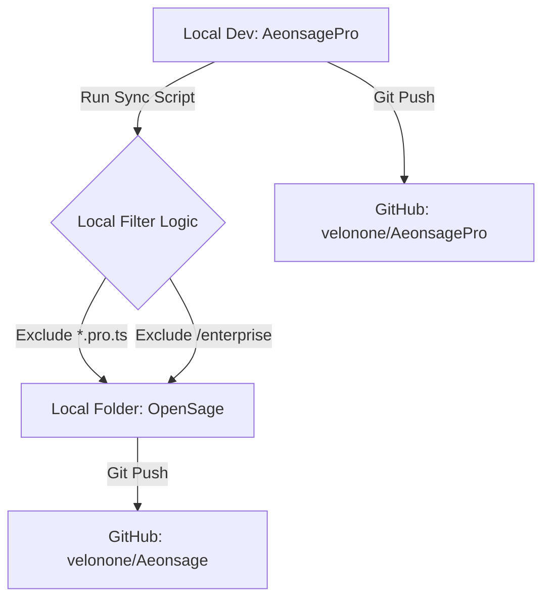

# AeonSage Pro to Open Source Sync Strategy

**Version 1.0** - 2026.1.28
**Author**: AeonSage Intelligence

---

## 1. Architecture Overview (Pro-First Strategy)
AeonSage adopts a **"Pro-First"** development model. All feature development, debugging, and testing occur within the private `AeonsagePro` repository. The Open Source version (`OpenSage`) is a **downstream artifact** generated automatically from the Pro codebase.

### Repository Mapping
| Repository Name | URL | Role | Access Level |
| :--- | :--- | :--- | :--- |
| **AeonsagePro** | `https://github.com/velonone/AeonsagePro` | **Source of Truth** (Master Repo) | Private (Enterprise) |
| **Aeonsage** | `https://github.com/velonone/Aeonsage` | **Public Release** (Distributable) | Public (Open Source) |

---

## 2. Sync Workflow (The "Air-Gapped" Protocol)
We utilize a local synchronization script to ensure commercial code (e.g., `god-key`, `vdid`) never leaks into the public domain.

### Flow Diagram


### Automation Scripts
The core logic resides in `scripts/sync-oss-simple.ps1` (Windows) and `.sh` (Mac/Linux).

**Key Actions Performed by Script:**
1.  **Target Resolution**: Automatically locates the `OpenSage` sub-directory.
2.  **Clean & Copy**: Syncs `src/`, `ui/`, `assets/`, `docs/` while purging stale files.
3.  **Security Filtering**: Enforces strict exclusion rules:
    *   `src/security/vdid*`
    *   `src/enterprise/*`
    *   `*.pro.ts`
    *   `god-key` logic

---

## 3. Operations Guide (For Engineers)

### How to Release a New Open Source Version

**Prerequisites**:
- Ensure the `OpenSage` directory exists at the project root.
- Ensure `OpenSage` is initialized as a git repo pointing to `https://github.com/velonone/Aeonsage.git`.

**Step-by-Step Execution**:

1.  **Update Version**: Bump version in `package.json` and update `CHANGELOG.md` in Pro repo.
2.  **Run Sync**:
    ```powershell
    # Windows
    .\scripts\sync-oss-simple.ps1
    ```
3.  **Verify & Push**:
    ```bash
    cd OpenSage
    git status  # CRITICAL: Check for any unexpected files!
    git add .
    git commit -m "release: v2026.x.x update"
    git push origin main
    ```

### Troubleshooting
- **"OpenSage directory not found"**: Ensure you have cloned the repo or initialized the folder.
- **Merge Conflicts**: Since `OpenSage` is a *downstream* repo, force pushing (`git push -f`) is generally acceptable if the history diverges, as long as it aligns with the latest Pro release.

---

## 4. Maintenance Notes
- **Do not** develop features directly in `OpenSage`. Always develop in `AeonsagePro` and sync down.
- **Asset Management**: New logos/images must be added to `AeonsagePro/assets` first, then synced.
